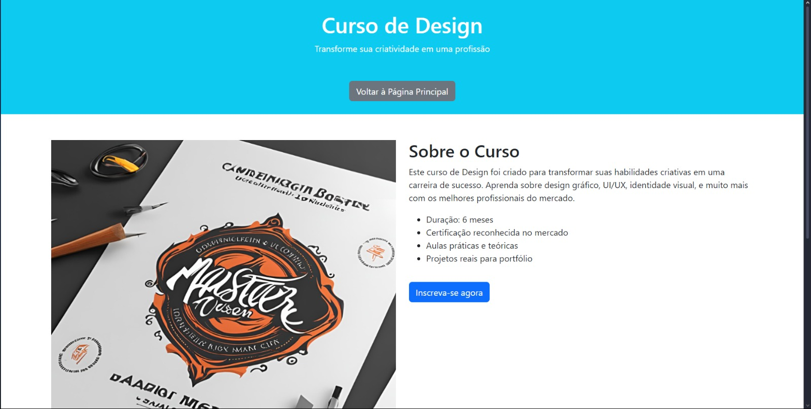
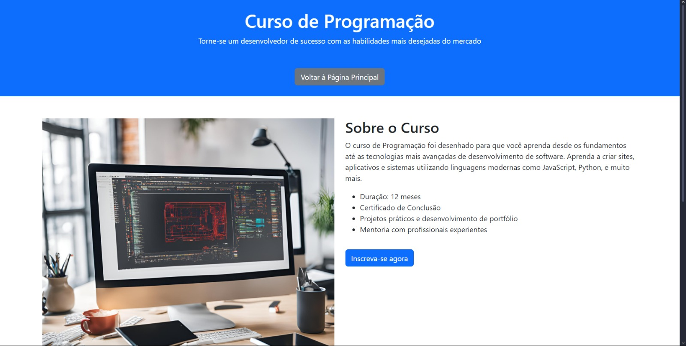
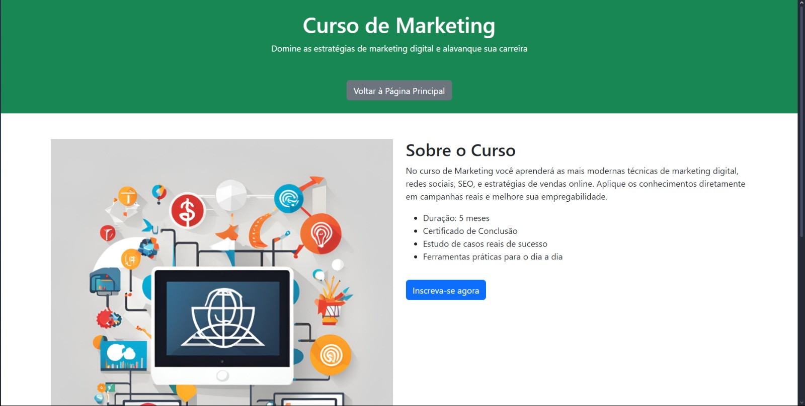

# Projeto de Páginas de Cursos

## Descrição do Projeto

<p align="center"></p>
<h1 align="center">
    Páginas Desenvolvidas
    <br>
    Landing Page
    <br>
    
    <br>
    Página do Curso de Design
    <br>
    
    <br>
    Página do Curso de Programação
    <br>
    
    <br>
    Página do Curso de marketing
    <br>
    
</h1>

## 🛠 Tecnologias

As seguintes ferramentas foram usadas na construção do projeto:

- [HTML5](https://developer.mozilla.org/pt-BR/docs/Web/HTML)
- [CSS3](https://developer.mozilla.org/pt-BR/docs/Web/CSS)
- [Bootstrap 5](https://getbootstrap.com/)

## 🚀 Como Executar o Projeto

Siga os passos abaixo para executar o projeto localmente:

1. Clone este repositório:
    ```bash
    git clone https://github.com/seu_usuario/projeto-web-cursos.git
    ```
2. Navegue até a pasta do projeto:
    ```bash
    cd projeto-web-cursos
    ```
3. Abra o arquivo **index.html** no navegador para visualizar a página principal.
4. As páginas de cursos podem ser acessadas pelos links "Saiba mais" na landing page ou diretamente por meio dos arquivos **design.html**, **programacao.html**, e **audiovisual.html**.

## Autor

Desenvolvido por **Lucas Hoepers Quinaglia**


[](https://www.linkedin.com/in/lucas-hoepers-quinaglia-365b93238/)
[](mailto:lucas.hoepers.quinaglia@gmail.com)
